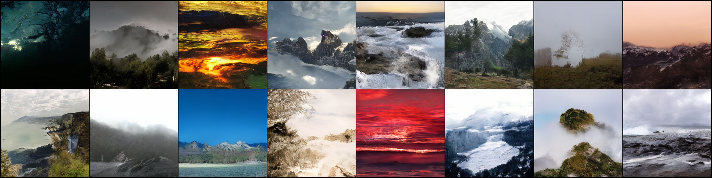
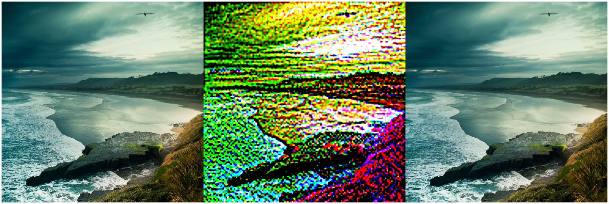
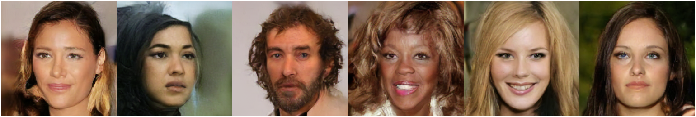
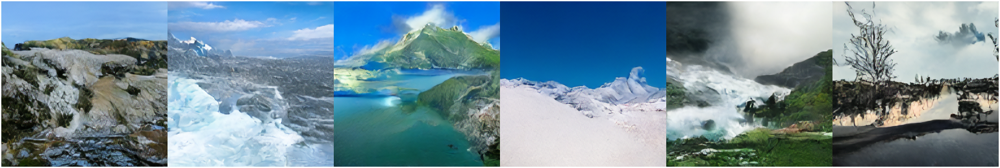

# Latent Diffusion Model - TensorFlow

**This work implements unofficial TF2 version of LDM based on the [official PyTorch version](https://github.com/CompVis/latent-diffusion).**<br>
**Compatibility: 2.13.0 <= TensorFlow <= 2.14.0**



Latent diffusion models are a class of generative models where the diffusion process we see in DDPM works in the latent space of images. LDM can be simply thought of as DDPM in the latent space of images. Autoencoding models are used to encode images to latent space and decode images from the latent space.

## Autoencoding Phase
This work utilizes a Vector Quantized Autoencoder for encoding and decoding images. The VQ model is trained to encode images to a discrete latent representation i.e. the images are encoded to discrete latent codes and produce high-quality images from the regularized latent space. The training also includes a discriminator to produce realistic-looking images. So the overall training objective is to train a VQGAN. 

### What does the latent space contain ?
<br> LEFT: ORIGINAL IMAGE       -          MIDDLE: LATENT SPACE            -             RIGHT: RECONSTRUCTED IMAGE



## Diffusion Phase 
The forward noising and gradual denoising happens in latent space of images which is obtained from the autoencoding phase. Similar to DDPM, A kind of UNet model is used for the training. [This](https://lilianweng.github.io/posts/2021-07-11-diffusion-models/) explains the working of diffusion process. 

### Unconditional generation

### CELEB-A DATASET

<br>

### LHQ-DATASET

<br>


### Class conditional generation

### FLOWERS-DATASET

<br>


### Text conditional generation

### COCO-DATASET 
* Perfect view of a city.
* Landscape of nature with lots of trees.
* View of snow mountains.
* A room in a house.
* A plate of tasty food.
* A long empty road.
<br><br>


*Moderate quality images are produced by the current text-to-img model training, 
and additional training or a more sophisticated model architecture may enhance the quality.*

## Target
* [x]  Unconditional modelling. <br>
* [x] Class conditioning modelling. <br>
* [x] Text conditioning modelling. <br>
* [x] Generative fill applications using DM. Result are uploaded [here](https://github.com/NITHISHM2410/diffusion-model-tf-generativefill) <br>


## Demo

**Demo Notebook is uploaded in [my Kaggle account](https://www.kaggle.com/nithishm2410) code section.**
<br>

### Code Snippets
Main params of Encoder, Decoder, Discriminator for VQ and UNet for DDPM, LDM are initialized from yaml files in 'model_configs'.
To change the main params, update changes in existing yaml config files or create new model config files using existing configs as a reference.


VQ Model
```python
from ldm.fs_modules.trainer_vqgan import Trainer as AETrainer # for VQ
ae_config = r"ldm/model_configs/fs/vqgan_ldm.yaml" 
ae_trainer = AETrainer(ae_config, ...) # Other params in docstring.

# to train
ae_trainer.train(...) # check params in doc string

# to eval
ae_trainer.evaluate(...) # check params in doc string

# to get AE reconstructions.
ae_trainer.sample(...) # check params in doc string
```


LDM
```python
from ldm.diffusion.trainer import  Trainer as DMTrainer # for DDPM/LDM

# Uncond modelling, replace with any other model config yaml file if needed.
dm_config = r'ldm/model_configs/ldm/uncond.yaml' 
dm_trainer = DMTrainer(dm_config, ...) # Other params in docstring.

dm_trainer.train(...) # check params in doc string
dm_trainer.evaluate(...) # check params in doc string

# to generate new images using trainer instance
dm_trainer.sample(...) # check params in doc string

# To generate new images directly using generator. 
from ldm.diffusion.generate import GenerateImages
generator = GenerateImages(...) # check params in docstring.
generator.sample() # check params in docstring.
```

## Weights
- All LDM weights & VQ weights along with optimizer states can be found at 'Input' section of the Kaggle demo notebook.
- VQ model weights can also be found [here](https://drive.google.com/drive/folders/1jYH7YGGGu-T_2f3OE_437KVKbpzZc4-o?usp=sharing)

## Acknowledgement
- [Official LDM in PyTorch](https://github.com/CompVis/latent-diffusion)
- [VQGAN in PyTorch](https://github.com/CompVis/taming-transformers)
- [LHQ Dataset](https://universome.github.io/alis)
- [CelebA Dataset](https://www.kaggle.com/datasets/badasstechie/celebahq-resized-256x256)
- [Flowers Dataset](https://www.kaggle.com/datasets/l3llff/flowers)


